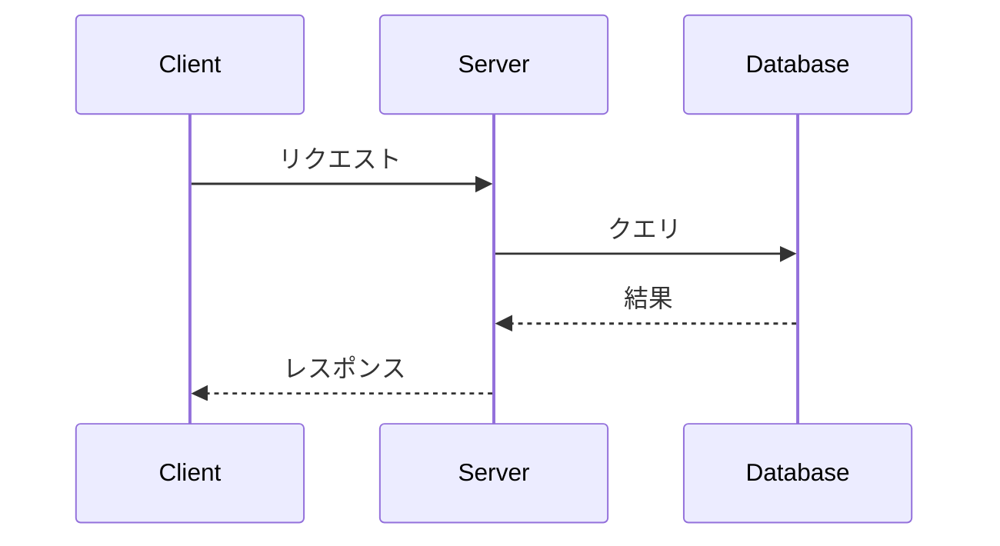

# 第20章　READMEとドキュメント --- プロジェクトの顔を作る

## 20.1 この章で学ぶこと

あなたがGitHubで面白そうなリポジトリを見つけたとき、最初に目にするのは何でしょうか。ファイル一覧の下に表示される、プロジェクトの説明文です。これが**README**と呼ばれるファイルの中身です。READMEはプロジェクトの「顔」であり、「玄関」であり、「名刺」でもあります。どんなに優れたコードでも、READMEがなければ誰にも使ってもらえません。

この章では以下のことを学びます。

- READMEの歴史と役割、GitHubにおける表示の仕組み
- 良いREADMEの書き方とテンプレート
- GitHub Flavored Markdown（GFM）の記法を網羅的に
- 用途別のREADMEテンプレート（CLI、Web、ライブラリ、研究）
- README作成のコツ --- 最初の3秒、バッジ、スクリーンショット
- Wiki、LICENSE、CONTRIBUTING、CODE_OF_CONDUCTなどの関連ファイル
- オープンソースライセンスの選び方

---

## 20.2 READMEとは何か

### 名前の由来 --- 1970年代からの伝統

READMEという名前は文字通り **"Read Me"（私を読んで）** という意味です。この慣習は1970年代のソフトウェア配布にまで遡ります。当時、ソフトウェアはテープやフロッピーディスクで配布されており、パッケージを開いた人が最初に読むべき説明書として、大文字で `README` と名付けたテキストファイルが同梱されていました。大文字にする理由は単純で、ファイル一覧がアルファベット順に表示されたとき、大文字のファイル名は小文字のファイル名よりも先に表示される（ASCIIコード順）ため、目立つからです。

この伝統は半世紀を経た現在でも生き続けています。GitHubをはじめとするほぼ全てのコードホスティングサービスは、READMEファイルを特別扱いし、自動的にレンダリングして表示します。

### GitHubでの役割 --- 自動表示の仕組み

GitHubでは、リポジトリのルートディレクトリに `README.md` ファイルがあると、ファイル一覧の下にその内容がHTMLに変換されて自動表示されます。つまり、リポジトリにアクセスした人が**スクロールせずに**最初に読める情報になります。

```
github.com/owner/repo にアクセスすると...

┌──────────────────────────────────────────────┐
│  owner / repo                     ⭐ Star    │
│                                               │
│  📁 src/                                      │
│  📁 tests/                                    │
│  📄 .gitignore                                │
│  📄 LICENSE                                   │
│  📄 README.md                                 │
│                                               │
│  ──────────────────────────────────────────── │
│  ↓ README.md の中身がここに描画される ↓        │
│                                               │
│  # My Project                                 │
│  This is an awesome project that...           │
│  ## Installation                              │
│  ...                                          │
└──────────────────────────────────────────────┘
```

<!-- screenshot: リポジトリトップページでREADMEが表示されている様子 -->

### `.md` の意味 --- Markdown形式

ファイル名の `.md` は **Markdown（マークダウン）** 形式であることを示しています。Markdownは、プレーンテキストに簡単な記号を付けるだけで、見出し・リスト・リンク・画像・テーブルなどの書式を表現できる軽量マークアップ言語です。2004年にJohn GruberとAaron Swartzによって作られました。

GitHubは `.md` ファイルを自動的にHTMLに変換して表示してくれます。`.txt` でもREADMEとして認識されますが、プレーンテキストのまま表示されるため、書式を活用できる `.md` を使うのが一般的です。

### READMEが表示される場所一覧

READMEが自動表示されるのはリポジトリのトップページだけではありません。

| 場所 | 表示されるREADME |
|------|-----------------|
| リポジトリのトップページ | ルートの `README.md` |
| サブディレクトリ | そのフォルダ内の `README.md`（あれば） |
| ユーザープロフィール | `{username}/{username}` リポジトリの `README.md` |
| Organization プロフィール | `.github` リポジトリの `profile/README.md` |

特に注目すべきは、自分のユーザー名と同名のリポジトリを作ると、そのREADMEがプロフィールページに表示されるという機能です。自己紹介や技術スタック、統計情報などを掲載して、個性的なプロフィールページを作ることができます。

---

## 20.3 READMEの書き方

### 最低限のREADME

READMEを書くのに完璧を目指す必要はありません。まずは最低限の情報を書くところから始めましょう。以下の3つの情報があれば、「READMEがない」状態とは雲泥の差です。

```markdown
# プロジェクト名

何をするプロジェクトかの1-2文の説明。

## 使い方

```bash
pip install my-package
my-command --input data.csv
```

## ライセンス

MIT
```

たった10行ほどですが、「何のプロジェクトか」「どうやって使うか」「ライセンスは何か」という最も基本的な情報が伝わります。

### 標準的なREADMEの構成

プロジェクトが成長してきたら、以下のようなセクション構成を目指しましょう。この構成はオープンソースプロジェクトで広く採用されている「型」です。

```markdown
# プロジェクト名


プロジェクトの概要を1-2文で。何を解決するのか、何が特徴か。

## 特徴

- 機能1: 簡潔な説明
- 機能2: 簡潔な説明
- 機能3: 簡潔な説明

## インストール

```bash
pip install my-package
```

## 使い方

```python
from my_package import MyClass

obj = MyClass()
result = obj.do_something()
print(result)
```

## 設定

| 環境変数 | 説明 | デフォルト |
|---------|------|----------|
| `API_KEY` | APIキー | なし（必須） |
| `DEBUG` | デバッグモード | `false` |

## 開発

```bash
git clone https://github.com/owner/repo.git
cd repo
pip install -e ".[dev]"
pytest
```

## 貢献

[CONTRIBUTING.md](CONTRIBUTING.md) を参照してください。

## ライセンス

MIT License - 詳細は [LICENSE](LICENSE) を参照。
```

この構成のポイントは、読者が上から順に読んでいくと、「概要 → 導入 → 使い方 → 詳細設定 → 開発参加」という自然な流れになっていることです。

---

## 20.4 Markdown記法

GitHub Flavored Markdown（GFM）は、標準的なMarkdownにGitHub独自の拡張を加えたものです。READMEだけでなく、Issue、Pull Request、Wikiなど、GitHub上のあらゆるテキスト入力欄で使えます。ここでは主要な記法をすべて紹介します。

### 見出し

`#` の数で見出しレベルを指定します。READMEでは `#`（h1）をプロジェクト名に使い、セクションには `##`（h2）以下を使うのが一般的です。

```markdown
# 見出し1（プロジェクト名に使う）
## 見出し2（主要セクションに使う）
### 見出し3（サブセクションに使う）
#### 見出し4
```

### 太字・斜体・取り消し線

```markdown
**太字（ボールド）** は重要な語句に使う
*斜体（イタリック）* は英語の用語や強調に使う
~~取り消し線~~ は古い情報の訂正に使う
`インラインコード` はコマンド名やファイル名に使う
```

### リスト

```markdown
- 箇条書きリスト
- 2つ目の項目
  - インデントでネストできる
  - さらにネスト

1. 番号付きリスト
2. 順序が重要なときに使う
3. 手順の説明に適している
```

### リンクと画像

```markdown
[リンクテキスト](https://example.com)
[別のリポジトリ](../other-repo)


```

### テーブル

テーブルはデータの比較や設定項目の一覧に便利です。コロン（`:`）の位置で列の揃え方を指定できます。

```markdown
| 左寄せ | 中央寄せ | 右寄せ |
|:-------|:------:|-------:|
| データ | データ  | データ |
| 左に揃う | 中央に揃う | 右に揃う |
```

### コードブロック

コードブロックはバッククォート3つで囲みます。言語名を指定すると、シンタックスハイライトが適用されます。

````markdown
```python
def hello(name):
    print(f"Hello, {name}!")
```

```bash
npm install express
node server.js
```

```diff
- 削除された行（赤く表示される）
+ 追加された行（緑に表示される）
```
````

`diff` 言語を指定すると、`-` で始まる行が赤、`+` で始まる行が緑で表示されます。変更点を説明するときに便利な記法です。

### タスクリスト

```markdown
- [x] 完了したタスク
- [ ] 未完了のタスク
- [ ] もう一つの未完了タスク
```

IssueやPRの本文に書くと、チェックボックスとして表示され、クリックで完了/未完了を切り替えられます。進捗管理に非常に便利です。

### 折りたたみ（details/summary）

長い内容を折りたたんで、必要なときだけ展開できるようにする記法です。HTMLタグを使います。

```markdown
<details>
<summary>クリックで展開 --- 詳細なログ出力</summary>

ここに折りたたまれた内容を書く。
コードブロックやリストなども使える。

```
長いログ出力
...
```

</details>
```

<!-- screenshot: 折りたたみの展開前と展開後 -->

### 注意・警告（Alerts）

GitHub独自の拡張で、注意事項や警告を目立つ形で表示できます。

```markdown
> [!NOTE]
> 補足情報。知っておくと便利だが必須ではない。

> [!TIP]
> ヒント。効率的な使い方のアドバイス。

> [!IMPORTANT]
> 重要。必ず理解しておくべき情報。

> [!WARNING]
> 警告。注意しないと問題が起きる可能性がある。

> [!CAUTION]
> 危険。データ損失やセキュリティリスクにつながる操作。
```

### Mermaid図

GitHubはMermaid記法をサポートしており、コードブロック内にテキストで書いた図をそのままレンダリングしてくれます。フローチャートやシーケンス図を画像として用意する必要がありません。

````markdown



````

### 数式（LaTeX）

GitHubは LaTeX 形式の数式レンダリングもサポートしています。

```markdown
インライン数式: $E = mc^2$

ブロック数式:
$$
\frac{n!}{k!(n-k)!} = \binom{n}{k}
$$
```

研究プロジェクトのREADMEや、アルゴリズムの説明に数式を使いたい場合に便利です。

---

## 20.5 ジャンル別READMEテンプレート

プロジェクトの種類によって、READMEに書くべき情報は異なります。ここでは4つの代表的なジャンルについて、それぞれのテンプレートを紹介します。

### CLIツール

CLIツールのREADMEでは、インストール方法と具体的なコマンド例が最も重要です。ユーザーは「すぐに使いたい」ので、コピーアンドペーストで動く例を最初に示しましょう。

```markdown
# my-cli-tool

CSVファイルを各種フォーマットに変換するコマンドラインツール。

## インストール

```bash
pip install my-cli-tool
```

## 使い方

```bash
# 基本的な使い方
my-cli input.csv --output result.json

# オプション一覧
my-cli --help
```

## オプション

| オプション | 短縮形 | 説明 | デフォルト |
|-----------|-------|------|----------|
| `--output` | `-o` | 出力ファイル | stdout |
| `--format` | `-f` | 出力形式（json/yaml/xml） | json |
| `--verbose` | `-v` | 詳細表示 | false |

## 使用例

```bash
# CSVをJSONに変換
my-cli data.csv -o data.json

# パイプと組み合わせる
cat data.csv | my-cli -f yaml > data.yml
```
```

### Webアプリ / API

Webアプリではデモへのリンク、技術スタック、環境変数の一覧が重要です。

```markdown
# My Web App

チームのタスク管理を効率化するWebアプリケーション。

## デモ

https://my-app.example.com

## 技術スタック

- **Frontend**: React, TypeScript, Tailwind CSS
- **Backend**: Node.js, Express
- **Database**: PostgreSQL
- **Infrastructure**: Docker, Vercel

## セットアップ

```bash
git clone https://github.com/owner/repo.git
cd repo
npm install
cp .env.example .env   # 環境変数を設定
npm run dev
```

## 環境変数

| 変数名 | 説明 | 必須 |
|--------|------|------|
| `DATABASE_URL` | DB接続文字列 | Yes |
| `API_KEY` | 外部API用キー | Yes |
| `PORT` | サーバーポート | No (default: 3000) |

## APIエンドポイント

| メソッド | パス | 説明 |
|---------|------|------|
| GET | `/api/users` | ユーザー一覧 |
| POST | `/api/users` | ユーザー作成 |
| GET | `/api/users/:id` | ユーザー詳細 |
```

### ライブラリ / パッケージ

ライブラリのREADMEでは、APIリファレンス（主要なクラスや関数の使い方）が重要です。

```markdown
# my-library

データ変換を簡潔に書けるPythonライブラリ。


## インストール

```bash
pip install my-library
```

## クイックスタート

```python
from my_library import Transformer

t = Transformer(format="json")
result = t.convert(data)
print(result)
```

## APIリファレンス

### `Transformer(format)`

| パラメータ | 型 | 説明 |
|-----------|-----|------|
| `format` | str | 出力形式（"json", "yaml", "xml"） |

### `Transformer.convert(data)`

入力データを指定形式に変換して返す。

| パラメータ | 型 | 説明 |
|-----------|-----|------|
| `data` | list / dict | 入力データ |
| **戻り値** | str | 変換結果の文字列 |
```

### 研究プロジェクト

研究プロジェクトのREADMEでは、論文へのリンク、実験の再現手順、結果の表、引用情報（BibTeX）が重要です。

```markdown
# ShortTitle

> Full Paper Title
> Authors (Year). *Journal Name*.

[論文](https://doi.org/xxx) | [プロジェクトページ](https://example.com)

## 概要

この研究では○○を○○する手法を提案した。

## 環境構築

```bash
conda create -n myenv python=3.11
conda activate myenv
pip install -r requirements.txt
```

## データの準備

1. [こちら](https://example.com/data)からデータをダウンロード
2. `data/` ディレクトリに配置

## 実験の再現

```bash
python train.py --config configs/experiment1.yaml
python evaluate.py --checkpoint outputs/best_model.pt
```

## 結果

| 手法 | Accuracy | F1 Score |
|------|----------|----------|
| Baseline | 85.2 | 83.1 |
| **Ours** | **91.7** | **90.3** |

## 引用

```bibtex
@article{author2024title,
  title={Full Paper Title},
  author={Author, A. and Author, B.},
  journal={Journal Name},
  year={2024}
}
```
```

---

## 20.6 README作成のコツ

### 最初の3秒で勝負が決まる

人がWebページに滞在するかどうかは、最初の数秒で決まると言われています。READMEも同じです。リポジトリを訪れた人は、最初の3秒で「自分にとって有用なプロジェクトかどうか」を判断します。

プロジェクト名の直後に、1-2文の明確な説明を書きましょう。「何を」「なぜ」「どう」を簡潔に伝えます。

```markdown
# fast-csv

Node.js向けの高速CSVパーサー。標準のcsv-parseより5倍速い。
```

### コピーアンドペーストで動くコードを載せる

使い方のセクションに載せるコード例は、読者がそのままコピーして実行できるものにしましょう。「ここを適宜変更してください」という箇所が多いと、試す前に心が折れてしまいます。

### スクリーンショットやGIFを使う

UIのあるプロジェクトでは、文章よりもスクリーンショット1枚の方が雄弁です。操作の流れを見せたい場合はGIFアニメーションが効果的です。

GIF作成ツールの例:
- **macOS**: Gifski、Kap
- **Windows**: ScreenToGif
- **CLI**: `ffmpeg -i video.mp4 -vf "fps=10,scale=800:-1" demo.gif`

### 目次を付ける（長いREADMEの場合）

READMEが長くなったら、冒頭に目次を付けると読者が必要なセクションに直接ジャンプできます。

```markdown
## 目次

- [インストール](#インストール)
- [使い方](#使い方)
- [設定](#設定)
- [貢献](#貢献)
```

GitHubはMarkdownの見出しに対して自動的にアンカーIDを生成するため、日本語の見出しでもリンクが機能します。

---

## 20.7 バッジの付け方

### shields.io --- 動的バッジ

READMEの冒頭にバッジを並べると、プロジェクトの状態が一目で分かり、プロフェッショナルな印象を与えます。**shields.io** は、GitHubのリポジトリ情報やCI/CDの状態などを元に動的なバッジ画像を生成してくれるサービスです。

```markdown
<!-- ビルド状態 -->


<!-- ライセンス -->


<!-- 最新リリースバージョン -->


<!-- 主要言語 -->


<!-- スター数 -->


<!-- パッケージレジストリのバージョン -->


<!-- カスタムバッジ（色とメッセージを自由に設定） -->

```

バッジのURLは `https://img.shields.io/` で始まり、その後に種類やパラメータを指定します。shields.ioのWebサイトにアクセスすると、対話的にバッジを作成できます。

### 技術スタックバッジ

プロジェクトで使っている技術をバッジで表示すると、一目で技術スタックが分かります。`style=for-the-badge` を指定すると、大きめの角丸バッジになります。

```markdown


```

ロゴ名は [Simple Icons](https://simpleicons.org/) で検索できます。色は各ブランドの公式カラーを使うのが一般的です。

---

## 20.8 Wiki

READMEはプロジェクトの「入口」ですが、詳細なドキュメントをすべてREADMEに書くと長くなりすぎます。そんなときは**Wiki**を活用しましょう。GitHubのWikiは、リポジトリに付属するドキュメント用のスペースで、複数ページのドキュメントを整理して書けます。

### 有効化

Wikiはリポジトリの設定から有効化します。

1. リポジトリページ → **Settings**
2. 左メニュー → **General**
3. **Features** セクションの **Wikis** にチェックを入れる

<!-- screenshot: Wiki有効化の設定画面 -->

### クローンと編集

WikiはGitリポジトリとしても扱えます。ブラウザ上で編集することもできますが、大量の編集をする場合はローカルにクローンして作業する方が効率的です。

```bash
# Wikiリポジトリをクローン
git clone https://github.com/owner/repo.wiki.git

# 編集作業
cd repo.wiki
# Markdownファイルを作成・編集

# 変更をプッシュ
git add .
git commit -m "Update documentation"
git push
```

WikiのURLは通常のリポジトリURLの末尾に `.wiki` を付けたものです。Wiki内のページはMarkdownファイルとして管理されるため、Gitの機能（履歴、差分、ブランチなど）をすべて活用できます。

---

## 20.9 よく使うファイル

GitHubのリポジトリには、README以外にもいくつかの「お約束」のファイルがあります。これらのファイルを適切に配置すると、GitHubが自動的に認識し、適切な場所にリンクを表示してくれます。

| ファイル | 配置場所 | 用途 |
|---------|---------|------|
| `README.md` | ルート | プロジェクトの説明 |
| `LICENSE` | ルート | ライセンス（GitHubがバッジで表示） |
| `CONTRIBUTING.md` | ルートまたは `.github/` | 貢献ガイドライン（Issue/PR作成時にリンク表示） |
| `CODE_OF_CONDUCT.md` | ルートまたは `.github/` | 行動規範 |
| `CHANGELOG.md` | ルート | バージョンごとの変更履歴 |
| `SECURITY.md` | ルートまたは `.github/` | 脆弱性報告の方法 |
| `.github/FUNDING.yml` | `.github/` | スポンサーボタンの設定 |

**CONTRIBUTING.md** を配置すると、新しいIssueやPull Requestを作成するときに「First time contributing? Read the contributing guidelines」というリンクがGitHubによって自動的に表示されます。コントリビューターに対して、コーディング規約やPRの出し方を事前に伝えることができます。

**CODE_OF_CONDUCT.md** は行動規範です。コミュニティの参加者に対して、敬意を持ったコミュニケーションを求めるルールを定めます。GitHubはテンプレートも用意しています（リポジトリの「Insights」タブ → 「Community Standards」から追加可能）。

**CHANGELOG.md** は「Keep a Changelog」（https://keepachangelog.com/）の形式で書くのが一般的です。バージョンごとに「Added（追加）」「Changed（変更）」「Fixed（修正）」「Removed（削除）」をまとめます。

**SECURITY.md** はセキュリティ上の脆弱性を発見した人が、どこに報告すればよいかを案内するファイルです。公開のIssueではなく、非公開の連絡手段（メールなど）を案内するのが一般的です。詳しくは第22章で扱います。

**.github/FUNDING.yml** を配置すると、リポジトリのトップページに「Sponsor」ボタンが表示されます。GitHub Sponsors、Open Collective、Patreonなどのリンクを設定できます。

---

## 20.10 ライセンスの選び方

オープンソースプロジェクトにとって、ライセンスは非常に重要です。ライセンスがないリポジトリは、たとえ公開されていても法的には「すべての権利が著者に留保されている」状態であり、他の人が安心してコードを使うことができません。

以下に代表的なオープンソースライセンスを比較します。

| ライセンス | 商用利用 | 改変 | 配布 | ソース公開義務 | 特徴 |
|-----------|---------|------|------|-------------|------|
| **MIT** | 可 | 可 | 可 | なし | 最もシンプル。制約が最も少ない |
| **Apache 2.0** | 可 | 可 | 可 | なし | 特許権の明示的許諾を含む |
| **GPL v3** | 可 | 可 | 可 | あり | 派生物も同じGPLで公開する義務 |
| **BSD 2-Clause** | 可 | 可 | 可 | なし | MITとほぼ同等。歴史的に使われている |
| **Unlicense** | 可 | 可 | 可 | なし | パブリックドメインに近い。制約ゼロ |

### 判断基準

**とにかく自由に使ってほしい場合**: **MIT License** が最も一般的です。短くてシンプルで、「著作権表示を残してくれれば何に使ってもいいですよ」というライセンスです。迷ったらMITを選んでおけば間違いありません。

**特許のリスクを考慮したい場合**: **Apache License 2.0** は特許権の許諾条項を含んでいるため、企業での利用時に特許訴訟のリスクを軽減できます。大規模なプロジェクトや企業主導のプロジェクトで採用されることが多いライセンスです。

**派生物もオープンソースであり続けてほしい場合**: **GPL v3** は、コードを使って作られた派生物（改変版やそれを組み込んだソフトウェア）も同じGPLで公開する義務を課します。このため、企業がコードを取り込んでプロプライエタリなソフトウェアに使うことを防げます。Linuxカーネルや多くのGNUソフトウェアがこのライセンスを採用しています。

**完全に自由にしたい場合**: **Unlicense** はパブリックドメインに相当するもので、著作権表示すら不要です。ただし、国によってはパブリックドメインの概念が法的に認められていないため、Unlicenseはその問題を回避するための法的文書を含んでいます。

GitHubでは、リポジトリ作成時にライセンスを選択するオプションがあります。後からでも「Add file」→「Create new file」でファイル名に `LICENSE` と入力すると、テンプレートを選択できるUIが表示されます。

<!-- screenshot: GitHubのライセンス選択UI -->

---

## 20.11 まとめ

この章では、READMEとプロジェクトドキュメントについて包括的に学びました。

- **README** は1970年代から続く伝統的なファイルで、GitHubではリポジトリのトップページに自動表示される「プロジェクトの顔」
- **最低限のREADME** でも「プロジェクト名」「使い方」「ライセンス」の3つがあれば十分に有用
- **Markdown記法** は見出し、リスト、テーブル、コードブロックに加え、タスクリスト、折りたたみ、注意/警告、Mermaid図、数式まで対応
- **ジャンル別テンプレート** を参考に、CLIツール、Webアプリ、ライブラリ、研究プロジェクトそれぞれに適した構成でREADMEを書く
- **バッジ** はshields.ioを使って動的に生成でき、プロジェクトの信頼感を高める
- **Wiki** はREADMEに収まらない詳細ドキュメントを整理するためのスペース
- **LICENSE、CONTRIBUTING、CODE_OF_CONDUCT、SECURITY** などの定番ファイルはGitHubが自動認識して適切にリンクしてくれる
- **ライセンス選び** は迷ったらMIT。特許が気になるならApache 2.0、コピーレフトを求めるならGPL v3

---

次の章 → [第21章　カスタマイズ --- GitHubを自分好みに整える](21-customization.md)
