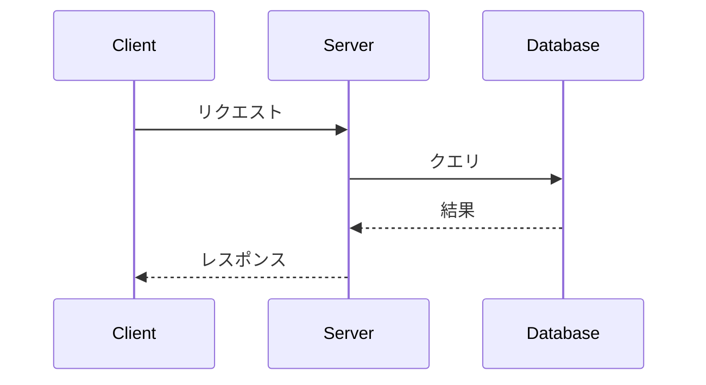

# 20. READMEとドキュメント

## READMEとは

リポジトリの「顔」。GitHub上で最初に表示されるドキュメント。プロジェクトの概要・使い方・貢献方法をまとめる。

## 良いREADMEの構成

```markdown
# プロジェクト名


プロジェクトの1-2行の説明

## 特徴

- 機能1の説明
- 機能2の説明
- 機能3の説明

## インストール

\```bash
pip install my-package
\```

## 使い方

\```python
from my_package import MyClass

obj = MyClass()
obj.do_something()
\```

## 設定

| 環境変数 | 説明 | デフォルト |
|---------|------|----------|
| `API_KEY` | APIキー | なし |
| `DEBUG` | デバッグモード | `false` |

## 開発

\```bash
git clone https://github.com/owner/repo.git
cd repo
pip install -e ".[dev]"
pytest
\```

## 貢献

[CONTRIBUTING.md](CONTRIBUTING.md) を参照してください。

## ライセンス

MIT License - 詳細は [LICENSE](LICENSE) を参照。
```

## Markdown記法（GitHub Flavored Markdown）

### 基本

```markdown
# 見出し1
## 見出し2
### 見出し3

**太字** *イタリック* ~~取り消し線~~ `インラインコード`

- リスト1
- リスト2
  - ネスト

1. 番号付きリスト
2. 番号付きリスト

> 引用文

[リンクテキスト](https://example.com)


```

### テーブル

```markdown
| 左寄せ | 中央寄せ | 右寄せ |
|:-------|:------:|-------:|
| データ | データ | データ |
```

### コードブロック

````markdown
```python
def hello():
    print("Hello, World!")
```

```diff
- 削除された行
+ 追加された行
```
````

### タスクリスト

```markdown
- [x] 完了したタスク
- [ ] 未完了のタスク
- [ ] もう一つの未完了タスク
```

### 折りたたみ

```markdown
<details>
<summary>クリックで展開</summary>

詳細な内容がここに表示される。
コードブロックなども使える。

</details>
```

### 注意・警告

```markdown
> [!NOTE]
> メモ: 補足情報

> [!TIP]
> ヒント: 便利な情報

> [!IMPORTANT]
> 重要: 必ず読んでほしい情報

> [!WARNING]
> 警告: 注意が必要

> [!CAUTION]
> 危険: 深刻な問題の可能性
```

### Mermaid図（GitHubが描画してくれる）

````markdown



````

### 数式（LaTeX）

```markdown
インライン数式: $E = mc^2$

ブロック数式:
$$
\frac{n!}{k!(n-k)!} = \binom{n}{k}
$$
```

## バッジ

READMEにステータスバッジを追加して、プロジェクトの状態を一目で表示。

### shields.io バッジ

```markdown
<!-- ビルド状態 -->


<!-- ライセンス -->


<!-- バージョン -->


<!-- 言語 -->


<!-- スター数 -->


<!-- npm バージョン -->


<!-- PyPI バージョン -->


<!-- カスタムバッジ -->

```

### 技術スタックバッジ

```markdown


```

## Wiki

リポジトリに付属するWikiページ。長いドキュメントに適している。

### 有効化

リポジトリ → Settings → Features → **Wikis** にチェック

### 操作

```bash
# Wikiをクローン（通常のGitリポジトリとして）
git clone https://github.com/owner/repo.wiki.git

# 編集してプッシュ
cd repo.wiki
# Markdownファイルを編集
git add .
git commit -m "Update documentation"
git push
```

## よく使うファイル

| ファイル | 場所 | 用途 |
|---------|------|------|
| `README.md` | ルート | プロジェクト説明 |
| `LICENSE` | ルート | ライセンス |
| `CONTRIBUTING.md` | ルート / `.github/` | 貢献ガイドライン |
| `CODE_OF_CONDUCT.md` | ルート / `.github/` | 行動規範 |
| `CHANGELOG.md` | ルート | 変更履歴 |
| `SECURITY.md` | ルート / `.github/` | セキュリティポリシー |
| `.github/FUNDING.yml` | `.github/` | スポンサーボタン |

## ライセンスの選び方

| ライセンス | 商用利用 | 改変 | 配布 | ソース公開義務 |
|-----------|---------|------|------|-------------|
| **MIT** | ✅ | ✅ | ✅ | ❌ |
| **Apache 2.0** | ✅ | ✅ | ✅ | ❌ |
| **GPL v3** | ✅ | ✅ | ✅ | ✅ |
| **BSD 2-Clause** | ✅ | ✅ | ✅ | ❌ |
| **Unlicense** | ✅ | ✅ | ✅ | ❌ |

> 迷ったら **MIT License** が最も一般的で制約が少ない。

## 次のステップ

→ [21. GitHubのカスタマイズ](21-customization.md) でGitHubを自分好みに設定しよう
