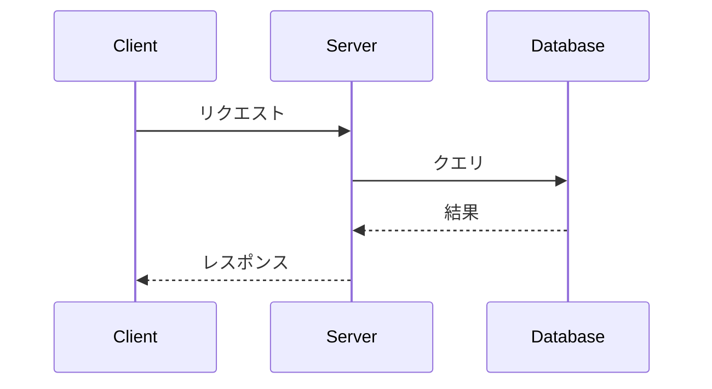

# 20. READMEとドキュメント

## READMEとは

### 名前の由来

README = **Read Me** = 「私を読んで」。

1970年代からソフトウェアに同梱される慣習があった。ディレクトリを開いたとき**最初に読むべきファイル**として、大文字で目立つように `README` と名付けられた。

### GitHubでの役割

GitHubでは `README.md` ファイルがリポジトリの**トップページに自動表示**される。つまり：

- リポジトリにアクセスした人が**最初に目にする情報**
- プロジェクトの**第一印象**を決める
- 「このプロジェクトは何か」「どう使うか」をここで伝える

```
github.com/owner/repo にアクセスすると...

┌─────────────────────────────────────────────┐
│  owner / repo                    ⭐ Star     │
│                                              │
│  📁 src/                                     │
│  📁 tests/                                   │
│  📄 .gitignore                               │
│  📄 LICENSE                                  │
│  📄 README.md   ← このファイル               │
│                                              │
│  ─────────────────────────────────────────── │
│  ↓ README.md の中身がここに描画される ↓       │
│                                              │
│  # My Project                                │
│  This is an awesome project that...          │
│  ## Installation                             │
│  ...                                         │
└─────────────────────────────────────────────┘
```

### README.md の `.md` とは

`.md` = **Markdown**（マークダウン）形式。

プレーンテキストに簡単な記号を付けるだけで、見出し・リスト・リンク・画像・表・コードブロックなどの書式を表現できる軽量マークアップ言語。

```markdown
# これが見出し1になる
## これが見出し2

**太字** と *斜体* が書ける

- リスト項目
- リスト項目

[リンク](https://example.com)
```

GitHubが `.md` ファイルを自動的にHTMLに変換して見やすく表示してくれる。

### READMEが表示される場所

| 場所 | 表示されるREADME |
|------|-----------------|
| リポジトリのトップ | ルートの `README.md` |
| サブディレクトリ | そのフォルダ内の `README.md`（あれば） |
| ユーザープロフィール | `username/username` リポジトリの `README.md` |
| Organization | `.github` リポジトリの `profile/README.md` |

### READMEが必要な理由

**READMEがないリポジトリは:**
- 何のプロジェクトか分からない
- 使い方が分からない
- 貢献の仕方が分からない
- 信頼性が低く見える

**良いREADMEがあるリポジトリは:**
- 一目で内容が分かる
- すぐに使い始められる
- 貢献者が集まりやすい
- プロフェッショナルに見える

## READMEの書き方（テンプレート付き）

### 最低限のREADME

```markdown
# プロジェクト名

何をするプロジェクトかの1-2文の説明。

## 使い方

\```bash
# インストール
pip install my-package

# 実行
my-command --input data.csv
\```

## ライセンス

MIT
```

これだけでも無いよりは100倍マシ。

### 標準的なREADME

## 良いREADMEの構成

```markdown
# プロジェクト名


プロジェクトの1-2行の説明

## 特徴

- 機能1の説明
- 機能2の説明
- 機能3の説明

## インストール

\```bash
pip install my-package
\```

## 使い方

\```python
from my_package import MyClass

obj = MyClass()
obj.do_something()
\```

## 設定

| 環境変数 | 説明 | デフォルト |
|---------|------|----------|
| `API_KEY` | APIキー | なし |
| `DEBUG` | デバッグモード | `false` |

## 開発

\```bash
git clone https://github.com/owner/repo.git
cd repo
pip install -e ".[dev]"
pytest
\```

## 貢献

[CONTRIBUTING.md](CONTRIBUTING.md) を参照してください。

## ライセンス

MIT License - 詳細は [LICENSE](LICENSE) を参照。
```

## Markdown記法（GitHub Flavored Markdown）

### 基本

```markdown
# 見出し1
## 見出し2
### 見出し3

**太字** *イタリック* ~~取り消し線~~ `インラインコード`

- リスト1
- リスト2
  - ネスト

1. 番号付きリスト
2. 番号付きリスト

> 引用文

[リンクテキスト](https://example.com)


```

### テーブル

```markdown
| 左寄せ | 中央寄せ | 右寄せ |
|:-------|:------:|-------:|
| データ | データ | データ |
```

### コードブロック

````markdown
```python
def hello():
    print("Hello, World!")
```

```diff
- 削除された行
+ 追加された行
```
````

### タスクリスト

```markdown
- [x] 完了したタスク
- [ ] 未完了のタスク
- [ ] もう一つの未完了タスク
```

### 折りたたみ

```markdown
<details>
<summary>クリックで展開</summary>

詳細な内容がここに表示される。
コードブロックなども使える。

</details>
```

### 注意・警告

```markdown
> [!NOTE]
> メモ: 補足情報

> [!TIP]
> ヒント: 便利な情報

> [!IMPORTANT]
> 重要: 必ず読んでほしい情報

> [!WARNING]
> 警告: 注意が必要

> [!CAUTION]
> 危険: 深刻な問題の可能性
```

### Mermaid図（GitHubが描画してくれる）

````markdown



````

### 数式（LaTeX）

```markdown
インライン数式: $E = mc^2$

ブロック数式:
$$
\frac{n!}{k!(n-k)!} = \binom{n}{k}
$$
```

## バッジ

READMEにステータスバッジを追加して、プロジェクトの状態を一目で表示。

### shields.io バッジ

```markdown
<!-- ビルド状態 -->


<!-- ライセンス -->


<!-- バージョン -->


<!-- 言語 -->


<!-- スター数 -->


<!-- npm バージョン -->


<!-- PyPI バージョン -->


<!-- カスタムバッジ -->

```

### 技術スタックバッジ

```markdown


```

## ジャンル別READMEテンプレート

### CLIツールのREADME

```markdown
# my-cli-tool

一言の説明。

## インストール

\```bash
pip install my-cli-tool
\```

## 使い方

\```bash
# 基本
my-cli input.csv --output result.json

# オプション一覧
my-cli --help
\```

## オプション

| オプション | 短縮 | 説明 | デフォルト |
|-----------|------|------|----------|
| `--output` | `-o` | 出力ファイル | stdout |
| `--format` | `-f` | 出力形式 | json |
| `--verbose` | `-v` | 詳細表示 | false |

## 使用例

\```bash
# CSVをJSONに変換
my-cli data.csv -o data.json

# パイプで使用
cat data.csv | my-cli -f yaml > data.yml
\```
```

### Webアプリ/APIのREADME

```markdown
# My Web App

一言の説明。

## デモ

🔗 https://my-app.example.com

## 技術スタック

- **Frontend**: React, TypeScript, Tailwind CSS
- **Backend**: Node.js, Express
- **Database**: PostgreSQL
- **Deploy**: Vercel

## セットアップ

\```bash
git clone https://github.com/owner/repo.git
cd repo
npm install
cp .env.example .env  # 環境変数を設定
npm run dev
\```

## 環境変数

| 変数名 | 説明 | 必須 |
|--------|------|------|
| `DATABASE_URL` | DB接続文字列 | ✅ |
| `API_KEY` | 外部API用キー | ✅ |
| `PORT` | サーバーポート | ❌ (default: 3000) |

## API エンドポイント

| メソッド | パス | 説明 |
|---------|------|------|
| GET | `/api/users` | ユーザー一覧 |
| POST | `/api/users` | ユーザー作成 |
| GET | `/api/users/:id` | ユーザー詳細 |
```

### ライブラリ/パッケージのREADME

```markdown
# my-library

一言の説明。


## インストール

\```bash
pip install my-library
\```

## クイックスタート

\```python
from my_library import MyClass

obj = MyClass(config="default")
result = obj.process(data)
print(result)
\```

## API リファレンス

### `MyClass(config)`

| パラメータ | 型 | 説明 |
|-----------|-----|------|
| `config` | str | 設定名 |

### `MyClass.process(data)`

データを処理して結果を返す。

| パラメータ | 型 | 説明 |
|-----------|-----|------|
| `data` | list | 入力データ |
| **戻り値** | dict | 処理結果 |
```

### 研究プロジェクトのREADME

```markdown
# 論文タイトルの短縮形

> 論文のフルタイトル
> Authors (Year). *Journal Name*.

📄 [論文](https://doi.org/xxx) | 🔗 [プロジェクトページ](https://example.com)

## 概要

この研究では〇〇を〇〇する手法を提案した。

## 環境構築

\```bash
conda create -n myenv python=3.11
conda activate myenv
pip install -r requirements.txt
\```

## データの準備

1. [ここ](https://example.com/data) からデータをダウンロード
2. `data/` ディレクトリに配置

## 実験の再現

\```bash
# 学習
python train.py --config configs/experiment1.yaml

# 評価
python evaluate.py --checkpoint outputs/best_model.pt
\```

## 結果

| 手法 | Accuracy | F1 Score |
|------|----------|----------|
| Baseline | 85.2 | 83.1 |
| **Ours** | **91.7** | **90.3** |

## 引用

\```bibtex
@article{author2024title,
  title={Full Paper Title},
  author={Author, A. and Author, B.},
  journal={Journal Name},
  year={2024}
}
\```
```

## README作成のコツ

### 1. 最初の3秒で内容が分かるように

ページを開いた瞬間に「何のプロジェクトか」が分かることが最重要。

```markdown
# 🎯 プロジェクト名

> 一言で伝わるキャッチフレーズ

何をするプロジェクトかの1-2文の説明。
```

### 2. コピペで動くコードを載せる

使い方の例は**そのままコピペして動く**ものを載せる。

```markdown
## 使い方

\```bash
pip install my-tool
my-tool --version
\```
```

### 3. スクリーンショットやGIFを使う

特にUIがあるプロジェクトでは視覚的に伝えることが大事。

```markdown
## デモ


```

GIF作成ツール：
- **macOS**: [Gifski](https://gif.ski/)、[Kap](https://getkap.co/)
- **Windows**: [ScreenToGif](https://www.screentogif.com/)
- **CLI**: `ffmpeg -i video.mp4 -vf "fps=10,scale=800:-1" demo.gif`

### 4. バッジで信頼感を出す

```markdown


```

### 5. 目次を付ける（長い場合）

Markdownでは見出しへのリンクが使える：

```markdown
## 目次

- [インストール](#インストール)
- [使い方](#使い方)
- [設定](#設定)
- [貢献](#貢献)
```

> GitHub は見出しに日本語を使っても自動でアンカーリンクを生成する。

## Wiki

リポジトリに付属するWikiページ。長いドキュメントに適している。

### 有効化

リポジトリ → Settings → Features → **Wikis** にチェック

### 操作

```bash
# Wikiをクローン（通常のGitリポジトリとして）
git clone https://github.com/owner/repo.wiki.git

# 編集してプッシュ
cd repo.wiki
# Markdownファイルを編集
git add .
git commit -m "Update documentation"
git push
```

## よく使うファイル

| ファイル | 場所 | 用途 |
|---------|------|------|
| `README.md` | ルート | プロジェクト説明 |
| `LICENSE` | ルート | ライセンス |
| `CONTRIBUTING.md` | ルート / `.github/` | 貢献ガイドライン |
| `CODE_OF_CONDUCT.md` | ルート / `.github/` | 行動規範 |
| `CHANGELOG.md` | ルート | 変更履歴 |
| `SECURITY.md` | ルート / `.github/` | セキュリティポリシー |
| `.github/FUNDING.yml` | `.github/` | スポンサーボタン |

## ライセンスの選び方

| ライセンス | 商用利用 | 改変 | 配布 | ソース公開義務 |
|-----------|---------|------|------|-------------|
| **MIT** | ✅ | ✅ | ✅ | ❌ |
| **Apache 2.0** | ✅ | ✅ | ✅ | ❌ |
| **GPL v3** | ✅ | ✅ | ✅ | ✅ |
| **BSD 2-Clause** | ✅ | ✅ | ✅ | ❌ |
| **Unlicense** | ✅ | ✅ | ✅ | ❌ |

> 迷ったら **MIT License** が最も一般的で制約が少ない。

## 次のステップ

→ [21. GitHubのカスタマイズ](21-customization.md) でGitHubを自分好みに設定しよう
